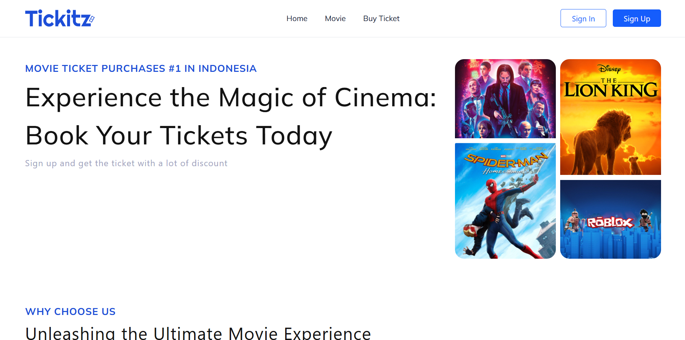
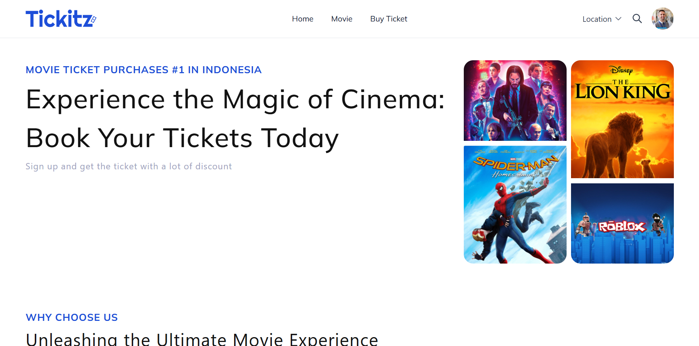
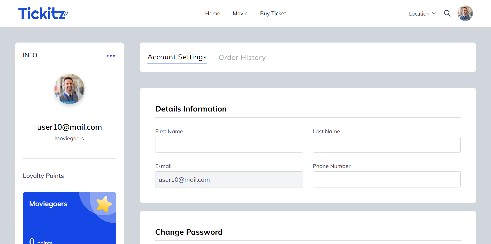
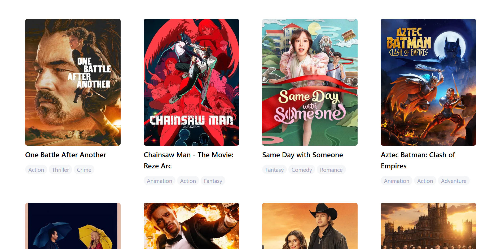

# darari-tickitz-app


Welcome to Tickitz Movies! 🎬
The ultimate movie booking web application that brings the cinema experience right to your screen. Designed for ease, speed, and style, Tickitz Movies lets users explore movies, choose showtimes, select seats, and make bookings—all in one seamless flow.

Inspired by the magic of cinema, every interaction in Tickitz Movies is crafted to feel smooth and engaging, just like watching your favorite film unfold.

This project is the frontend for the Tickitz Movies Backend
, built using React.js as the main frontend library, JavaScript as the programming language, and Redux for global state management.

## 🔧 Tech Stack

- [React.js](https://react.dev/)
- [tailwind](https://tailwindcss.com/)
- [Javascript](https://developer.mozilla.org/en-US/docs/Web/JavaScript)
- [Redux](https://redux-toolkit.js.org/)

## 🗝️ Environment

```bash

# Base url for backend
VITE_BE_TICKITZ_API=<backend_address>

```

## ⚙️ Installation

1. Clone the project

```sh
$ https://github.com/Darari17/fe-tickitz-react.git
```

2. Navigate to project directory

```sh
$ cd darari-tickitz-app
```

3. Install dependencies

```sh
$ npm install
```

4. Run project

```sh
$ npm run dev
```

## 💻 DEMO

<div align="center">


 </br>



</div>

## 📄 LICENSE

MIT License

Copyright (c) 2025 Farid Rhamadhan Darari

## 📧 Contact Info & Contributor

[https://github.com/Darari17](https://github.com/Darari17)

## 🎯 Related Project

[https://github.com/Darari17/be-tickitz-go](https://github.com/Darari17/be-tickitz-go)
